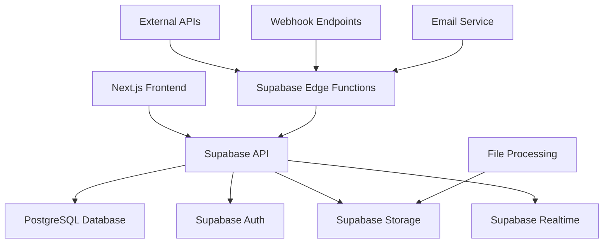

# AERO CRM Platform - Tasarım Dokümantasyonu

## Genel Bakış

AERO CRM, modern satış ekipleri için tasarlanmış kapsamlı bir müşteri ilişkileri yönetimi ve teklif hazırlama platformudur. Platform, Next.js 14, TypeScript, Supabase ve Tailwind CSS teknolojileri kullanılarak geliştirilecektir.

### Temel Tasarım Prensipleri

1. **"3-Saniye Kuralı"** - Kullanıcı herhangi bir sayfada 3 saniye içinde ne yapması gerektiğini anlamalı
2. **"Progressive Disclosure"** - Karmaşık bilgiler katman katman gösterilir
3. **"Mobile-First, Desktop-Enhanced"** - Mobilde %100 işlevsel, masaüstünde genişletilmiş deneyim
4. **"Hız ve Verimlilik"** - Tüm aksiyonlar 3 tık veya daha az

## Mimari

### Teknoloji Stack'i (SSR ve Performans Odaklı)

```
Frontend (SSR Optimized):
├── Next.js 14 (App Router + SSR/SSG)
├── TypeScript
├── Tailwind CSS (JIT compilation)
├── Framer Motion (animasyonlar)
├── React Beautiful DnD (kanban sürükle-bırak)
├── @dnd-kit/core (gelişmiş sürükle-bırak)
├── Lucide Icons
├── React Hook Form + Zod (form yönetimi)
├── React Signature Canvas (e-imza)
├── React Quill (zengin metin editörü)
├── Recharts (analitik grafikleri)
├── React Dropzone (dosya yükleme)
├── React Hot Toast (bildirimler)
├── Zustand (client state yönetimi)
├── TanStack Query (server state + caching)
├── Date-fns (tarih işlemleri)
├── React Virtualized (büyük listeler)
└── SWR (real-time data fetching)

Backend (Real-time Optimized):
├── Supabase (PostgreSQL + Real-time)
├── Supabase Auth (kimlik doğrulama)
├── Supabase Realtime (WebSocket connections)
├── Supabase Storage (dosya depolama)
├── Supabase Edge Functions (webhook'lar)
├── Resend (e-posta gönderimi)
├── Stripe (ödeme işlemleri)
├── Sharp (görsel işleme)
└── Supabase Connection Pooling (performans)

Caching & Performance:
├── Vercel Edge Functions (SSR)
├── Supabase Cloud (backend)
├── Cloudflare (CDN + Edge caching)
├── Upstash Redis (session + data caching)
├── Next.js ISR (Incremental Static Regeneration)
└── Service Worker (offline support)
```

### SSR ve Performans Mimarisi

#### Server-Side Rendering Stratejisi
```typescript
// app/dashboard/page.tsx - SSR Dashboard
import { createServerComponentClient } from '@supabase/auth-helpers-nextjs'
import { cookies } from 'next/headers'
import { DashboardMetrics } from '@/components/dashboard/metrics'
import { RealtimeDeals } from '@/components/deals/realtime-deals'

export default async function DashboardPage() {
  const supabase = createServerComponentClient({ cookies })
  
  // SSR'da veri çekme - sayfa yüklenmeden önce hazır
  const [
    { data: user },
    { data: metrics },
    { data: deals },
    { data: activities }
  ] = await Promise.all([
    supabase.auth.getUser(),
    supabase.rpc('get_dashboard_metrics'),
    supabase.from('deals').select('*').limit(20),
    supabase.from('activities').select('*').limit(10)
  ])
  
  return (
    <div className="dashboard">
      {/* SSR ile render edilen metrikler */}
      <DashboardMetrics initialData={metrics} />
      
      {/* Gerçek zamanlı güncellemeli anlaşmalar */}
      <RealtimeDeals initialDeals={deals} />
      
      {/* Aktivite akışı */}
      <ActivityFeed initialActivities={activities} />
    </div>
  )
}

// Metadata ve SEO optimizasyonu
export async function generateMetadata() {
  return {
    title: 'Dashboard - AERO CRM',
    description: 'Satış performansınızı takip edin'
  }
}
```

#### Gerçek Zamanlı Sistem (Ultra Hızlı)
```typescript
// hooks/useRealtimeCollaboration.ts
import { useEffect, useCallback } from 'react'
import { supabase } from '@/lib/supabase'
import { useAppStore } from '@/store/app-store'

export const useRealtimeCollaboration = () => {
  const { addNotification, updateDeal, updateProposal } = useAppStore()
  
  useEffect(() => {
    // Çoklu kanal dinleme - maksimum hız için
    const channels = [
      // Anlaşma değişiklikleri
      supabase
        .channel('deals-realtime')
        .on('postgres_changes', {
          event: '*',
          schema: 'public',
          table: 'deals'
        }, (payload) => {
          // Anında UI güncellemesi
          if (payload.eventType === 'UPDATE') {
            updateDeal(payload.new.id, payload.new)
            
            // Takım üyelerine bildirim
            addNotification({
              type: 'info',
              title: 'Anlaşma Güncellendi',
              message: `${payload.new.title} anlaşması güncellendi`,
              timestamp: new Date().toISOString()
            })
          }
        }),
      
      // Teklif etkileşimleri
      supabase
        .channel('proposals-realtime')
        .on('postgres_changes', {
          event: 'INSERT',
          schema: 'public',
          table: 'proposal_views'
        }, (payload) => {
          // Teklif görüntülendi bildirimi
          addNotification({
            type: 'success',
            title: '🔔 Teklif Görüntülendi!',
            message: `Teklifiniz şu an görüntüleniyor`,
            timestamp: new Date().toISOString()
          })
        }),
      
      // Takım aktiviteleri
      supabase
        .channel('team-activities')
        .on('postgres_changes', {
          event: 'INSERT',
          schema: 'public',
          table: 'activities'
        }, (payload) => {
          // Takım aktivitesi bildirimi
          if (payload.new.user_id !== getCurrentUserId()) {
            addNotification({
              type: 'info',
              title: 'Takım Aktivitesi',
              message: payload.new.description,
              timestamp: new Date().toISOString()
            })
          }
        })
    ]
    
    // Tüm kanalları abone ol
    channels.forEach(channel => channel.subscribe())
    
    return () => {
      // Temizlik
      channels.forEach(channel => supabase.removeChannel(channel))
    }
  }, [])
}
```

#### Optimistic Updates (Anında UI Güncellemesi)
```typescript
// hooks/useOptimisticDeals.ts
import { useMutation, useQueryClient } from '@tanstack/react-query'
import { useAppStore } from '@/store/app-store'

export const useOptimisticDealUpdate = () => {
  const queryClient = useQueryClient()
  const { updateDeal } = useAppStore()
  
  return useMutation({
    mutationFn: async ({ dealId, updates }: { dealId: string, updates: Partial<Deal> }) => {
      // 1. Anında UI güncellemesi (optimistic)
      updateDeal(dealId, updates)
      
      // 2. Server'a gönder
      const { data, error } = await supabase
        .from('deals')
        .update(updates)
        .eq('id', dealId)
        .select()
        .single()
      
      if (error) throw error
      return data
    },
    
    onError: (error, variables) => {
      // Hata durumunda geri al
      queryClient.invalidateQueries(['deals'])
      
      // Kullanıcıya bildir
      toast.error('Güncelleme başarısız, tekrar deneyin')
    },
    
    onSuccess: (data) => {
      // Başarılı güncelleme
      queryClient.setQueryData(['deals'], (old: Deal[]) =>
        old?.map(deal => deal.id === data.id ? data : deal)
      )
    }
  })
}
```

#### Performans Optimizasyonları
```typescript
// lib/performance.ts

// 1. Connection Pooling
export const supabase = createClient(
  process.env.NEXT_PUBLIC_SUPABASE_URL!,
  process.env.NEXT_PUBLIC_SUPABASE_ANON_KEY!,
  {
    db: {
      schema: 'public',
    },
    auth: {
      persistSession: true,
      autoRefreshToken: true,
    },
    realtime: {
      params: {
        eventsPerSecond: 10, // Yüksek frekanslı güncellemeler
      },
    },
  }
)

// 2. Query Optimizasyonu
export const optimizedQueries = {
  // Sadece gerekli alanları çek
  getDashboardData: () => supabase
    .from('deals')
    .select('id, title, value, stage, contact:contacts(full_name)')
    .limit(20),
  
  // İndeksli sorgular
  getDealsWithIndex: (userId: string) => supabase
    .from('deals')
    .select('*')
    .eq('user_id', userId) // İndeksli alan
    .order('created_at', { ascending: false }),
  
  // Materialized view kullanımı
  getDashboardMetrics: () => supabase
    .rpc('get_dashboard_metrics_fast') // Önceden hesaplanmış
}

// 3. Caching Stratejisi
export const cacheConfig = {
  // TanStack Query cache süresi
  staleTime: 1000 * 60 * 5, // 5 dakika
  cacheTime: 1000 * 60 * 30, // 30 dakika
  
  // Next.js ISR
  revalidate: 60, // 1 dakika
  
  // Redis cache
  redisTTL: 300, // 5 dakika
}
```

#### Database Optimizasyonları
```sql
-- Performans için kritik indeksler
CREATE INDEX CONCURRENTLY idx_deals_user_stage ON deals(user_id, stage);
CREATE INDEX CONCURRENTLY idx_deals_updated_at ON deals(updated_at DESC);
CREATE INDEX CONCURRENTLY idx_proposals_status_created ON proposals(status, created_at DESC);
CREATE INDEX CONCURRENTLY idx_activities_team_created ON activities(team_id, created_at DESC);

-- Materialized view - dashboard metrikleri için
CREATE MATERIALIZED VIEW dashboard_metrics AS
SELECT 
  user_id,
  COUNT(*) FILTER (WHERE stage != 'won' AND stage != 'lost') as open_deals,
  SUM(value) FILTER (WHERE stage = 'won' AND DATE_TRUNC('month', updated_at) = DATE_TRUNC('month', NOW())) as monthly_revenue,
  ROUND(
    COUNT(*) FILTER (WHERE stage = 'won')::numeric / 
    NULLIF(COUNT(*) FILTER (WHERE stage IN ('won', 'lost')), 0) * 100, 
    2
  ) as conversion_rate,
  SUM(value) FILTER (WHERE stage NOT IN ('won', 'lost')) as pipeline_value
FROM deals 
GROUP BY user_id;

-- Otomatik refresh
CREATE OR REPLACE FUNCTION refresh_dashboard_metrics()
RETURNS void AS $$
BEGIN
  REFRESH MATERIALIZED VIEW CONCURRENTLY dashboard_metrics;
END;
$$ LANGUAGE plpgsql;

-- Trigger ile otomatik güncelleme
CREATE OR REPLACE FUNCTION trigger_refresh_dashboard()
RETURNS trigger AS $$
BEGIN
  PERFORM pg_notify('refresh_dashboard', NEW.user_id::text);
  RETURN NEW;
END;
$$ LANGUAGE plpgsql;

CREATE TRIGGER deals_changed
  AFTER INSERT OR UPDATE OR DELETE ON deals
  FOR EACH ROW EXECUTE FUNCTION trigger_refresh_dashboard();
```

#### Edge Functions (Webhook Performansı)
```typescript
// supabase/functions/webhook-handler/index.ts
import { serve } from 'https://deno.land/std@0.168.0/http/server.ts'
import { createClient } from 'https://esm.sh/@supabase/supabase-js@2'

serve(async (req) => {
  try {
    const { event, payload } = await req.json()
    
    // Paralel webhook gönderimi - maksimum hız
    const webhooks = await supabase
      .from('webhooks')
      .select('url, secret_key')
      .eq('active', true)
      .contains('events', [event])
    
    // Tüm webhook'ları paralel gönder
    const promises = webhooks.data?.map(async (webhook) => {
      const response = await fetch(webhook.url, {
        method: 'POST',
        headers: {
          'Content-Type': 'application/json',
          'X-Webhook-Signature': await generateSignature(payload, webhook.secret_key)
        },
        body: JSON.stringify(payload)
      })
      
      return {
        url: webhook.url,
        status: response.status,
        success: response.ok
      }
    }) || []
    
    const results = await Promise.allSettled(promises)
    
    return new Response(JSON.stringify({ results }), {
      headers: { 'Content-Type': 'application/json' }
    })
  } catch (error) {
    return new Response(JSON.stringify({ error: error.message }), {
      status: 500,
      headers: { 'Content-Type': 'application/json' }
    })
  }
})
```

Bu SSR ve gerçek zamanlı performans optimizasyonları ile AERO CRM ultra hızlı çalışacak ve takım üyeleri tüm değişiklikleri anında görecek!

### Özel Kütüphane Detayları

#### Sürükle-Bırak Sistemi
```typescript
// Kanban için React Beautiful DnD
import { DragDropContext, Droppable, Draggable } from 'react-beautiful-dnd'

// Teklif editörü için @dnd-kit
import {
  DndContext,
  closestCenter,
  KeyboardSensor,
  PointerSensor,
  useSensor,
  useSensors,
} from '@dnd-kit/core'
import {
  arrayMove,
  SortableContext,
  sortableKeyboardCoordinates,
  verticalListSortingStrategy,
} from '@dnd-kit/sortable'
import {
  useSortable,
} from '@dnd-kit/sortable'

// Kanban sürükle-bırak konfigürasyonu
const onDragEnd = (result: DropResult) => {
  if (!result.destination) return
  
  const { source, destination, draggableId } = result
  
  // Aynı sütun içinde hareket
  if (source.droppableId === destination.droppableId) {
    const newDeals = Array.from(deals)
    const [reorderedDeal] = newDeals.splice(source.index, 1)
    newDeals.splice(destination.index, 0, reorderedDeal)
    setDeals(newDeals)
  } else {
    // Farklı sütunlar arası hareket
    updateDealStage(draggableId, destination.droppableId as DealStage)
  }
}
```

#### E-İmza Sistemi
```typescript
// React Signature Canvas
import SignatureCanvas from 'react-signature-canvas'

interface SignaturePadProps {
  onSave: (signature: string) => void
  onClear: () => void
}

const SignaturePad: React.FC<SignaturePadProps> = ({ onSave, onClear }) => {
  const sigCanvas = useRef<SignatureCanvas>(null)
  
  const handleSave = () => {
    if (sigCanvas.current) {
      const signatureData = sigCanvas.current.toDataURL('image/png')
      onSave(signatureData)
    }
  }
  
  const handleClear = () => {
    if (sigCanvas.current) {
      sigCanvas.current.clear()
      onClear()
    }
  }
  
  return (
    <div className="border border-gray-300 rounded-lg">
      <SignatureCanvas
        ref={sigCanvas}
        penColor="black"
        canvasProps={{
          width: 500,
          height: 200,
          className: 'signature-canvas'
        }}
      />
      <div className="p-4 flex gap-2">
        <button onClick={handleClear} className="btn-secondary">
          Temizle
        </button>
        <button onClick={handleSave} className="btn-primary">
          İmzayı Kaydet
        </button>
      </div>
    </div>
  )
}
```

#### Zengin Metin Editörü
```typescript
// React Quill konfigürasyonu
import ReactQuill from 'react-quill'
import 'react-quill/dist/quill.snow.css'

const modules = {
  toolbar: [
    [{ 'header': [1, 2, 3, false] }],
    ['bold', 'italic', 'underline', 'strike'],
    [{ 'list': 'ordered'}, { 'list': 'bullet' }],
    ['link', 'image'],
    ['clean']
  ],
}

const formats = [
  'header', 'bold', 'italic', 'underline', 'strike',
  'list', 'bullet', 'link', 'image'
]

<ReactQuill
  theme="snow"
  value={content}
  onChange={setContent}
  modules={modules}
  formats={formats}
  placeholder="Notunuzu yazın..."
/>
```

#### Dosya Yükleme Sistemi
```typescript
// React Dropzone
import { useDropzone } from 'react-dropzone'

const FileUpload: React.FC<FileUploadProps> = ({ onUpload }) => {
  const { getRootProps, getInputProps, isDragActive } = useDropzone({
    accept: {
      'image/*': ['.png', '.jpg', '.jpeg', '.gif'],
      'application/pdf': ['.pdf'],
      'application/msword': ['.doc', '.docx']
    },
    maxSize: 10 * 1024 * 1024, // 10MB
    onDrop: async (acceptedFiles) => {
      for (const file of acceptedFiles) {
        const { data, error } = await supabase.storage
          .from('proposal-files')
          .upload(`${Date.now()}-${file.name}`, file)
        
        if (data) {
          onUpload(data.path)
        }
      }
    }
  })
  
  return (
    <div
      {...getRootProps()}
      className={`border-2 border-dashed rounded-lg p-8 text-center cursor-pointer
        ${isDragActive ? 'border-primary bg-primary/5' : 'border-gray-300'}
      `}
    >
      <input {...getInputProps()} />
      <div className="space-y-2">
        <div className="text-4xl">📁</div>
        <p className="text-lg font-medium">
          {isDragActive ? 'Dosyaları buraya bırakın' : 'Dosya yüklemek için tıklayın'}
        </p>
        <p className="text-sm text-gray-500">
          PNG, JPG, PDF, DOC (max 10MB)
        </p>
      </div>
    </div>
  )
}
```

#### Analitik Grafikleri
```typescript
// Recharts konfigürasyonu
import {
  LineChart,
  Line,
  XAxis,
  YAxis,
  CartesianGrid,
  Tooltip,
  ResponsiveContainer,
  PieChart,
  Pie,
  Cell,
  BarChart,
  Bar
} from 'recharts'

// Dönüşüm hunisi grafiği
const FunnelChart: React.FC<{ data: FunnelData[] }> = ({ data }) => {
  return (
    <ResponsiveContainer width="100%" height={300}>
      <BarChart data={data} layout="horizontal">
        <CartesianGrid strokeDasharray="3 3" />
        <XAxis type="number" />
        <YAxis dataKey="stage" type="category" />
        <Tooltip />
        <Bar dataKey="count" fill="#3B82F6" />
      </BarChart>
    </ResponsiveContainer>
  )
}

// Zaman serisi grafiği
const TimeSeriesChart: React.FC<{ data: TimeSeriesData[] }> = ({ data }) => {
  return (
    <ResponsiveContainer width="100%" height={400}>
      <LineChart data={data}>
        <CartesianGrid strokeDasharray="3 3" />
        <XAxis dataKey="date" />
        <YAxis />
        <Tooltip />
        <Line 
          type="monotone" 
          dataKey="proposals" 
          stroke="#3B82F6" 
          strokeWidth={2}
        />
        <Line 
          type="monotone" 
          dataKey="signed" 
          stroke="#10B981" 
          strokeWidth={2}
        />
      </LineChart>
    </ResponsiveContainer>
  )
}
```

#### State Yönetimi (Zustand)
```typescript
// Global state store
import { create } from 'zustand'
import { subscribeWithSelector } from 'zustand/middleware'

interface AppState {
  user: User | null
  deals: Deal[]
  notifications: Notification[]
  
  // Actions
  setUser: (user: User | null) => void
  addDeal: (deal: Deal) => void
  updateDeal: (id: string, updates: Partial<Deal>) => void
  addNotification: (notification: Notification) => void
}

export const useAppStore = create<AppState>()(
  subscribeWithSelector((set, get) => ({
    user: null,
    deals: [],
    notifications: [],
    
    setUser: (user) => set({ user }),
    
    addDeal: (deal) => set((state) => ({
      deals: [...state.deals, deal]
    })),
    
    updateDeal: (id, updates) => set((state) => ({
      deals: state.deals.map(deal => 
        deal.id === id ? { ...deal, ...updates } : deal
      )
    })),
    
    addNotification: (notification) => set((state) => ({
      notifications: [...state.notifications, notification]
    }))
  }))
)
```

#### Gerçek Zamanlı Güncellemeler
```typescript
// Supabase Realtime
import { useEffect } from 'react'
import { supabase } from '@/lib/supabase'

export const useRealtimeDeals = () => {
  const { deals, addDeal, updateDeal } = useAppStore()
  
  useEffect(() => {
    const channel = supabase
      .channel('deals-changes')
      .on(
        'postgres_changes',
        {
          event: 'INSERT',
          schema: 'public',
          table: 'deals'
        },
        (payload) => {
          addDeal(payload.new as Deal)
        }
      )
      .on(
        'postgres_changes',
        {
          event: 'UPDATE',
          schema: 'public',
          table: 'deals'
        },
        (payload) => {
          updateDeal(payload.new.id, payload.new as Partial<Deal>)
        }
      )
      .subscribe()
    
    return () => {
      supabase.removeChannel(channel)
    }
  }, [])
  
  return deals
}
```

### Sistem Mimarisi



## Bileşenler ve Arayüzler

### 1. Kimlik Doğrulama Sistemi

**Bileşenler:**
- `AuthProvider` - Kimlik doğrulama context'i
- `LoginForm` - Giriş formu
- `RegisterForm` - Kayıt formu
- `PasswordResetForm` - Şifre sıfırlama
- `OAuthButtons` - Sosyal giriş butonları

**Arayüzler:**
```typescript
interface User {
  id: string
  email: string
  full_name: string
  avatar_url?: string
  role: 'admin' | 'member' | 'viewer'
  team_id?: string
  created_at: string
  updated_at: string
}

interface AuthState {
  user: User | null
  loading: boolean
  signIn: (email: string, password: string) => Promise<void>
  signUp: (email: string, password: string, fullName: string) => Promise<void>
  signOut: () => Promise<void>
  resetPassword: (email: string) => Promise<void>
}
```

### 2. Dashboard Sistemi

**Bileşenler:**
- `DashboardLayout` - Ana layout wrapper
- `MetricCard` - Metrik gösterim kartı
- `ActivityFeed` - Aktivite akışı
- `QuickActions` - Hızlı aksiyon butonları
- `WelcomeSection` - Karşılama bölümü

**Arayüzler:**
```typescript
interface DashboardMetrics {
  open_proposals: number
  monthly_revenue: number
  conversion_rate: number
  pipeline_value: number
  trends: {
    proposals: number
    revenue: number
    conversion: number
  }
}

interface Activity {
  id: string
  type: 'proposal_sent' | 'deal_won' | 'meeting_scheduled'
  title: string
  description: string
  user_id: string
  created_at: string
  metadata?: Record<string, any>
}
```

### 3. CRM Kanban Sistemi

**Bileşenler:**
- `KanbanBoard` - Ana kanban container
- `KanbanColumn` - Sütun bileşeni
- `DealCard` - Anlaşma kartı
- `DragDropProvider` - Sürükle-bırak context'i

**Arayüzler:**
```typescript
interface Deal {
  id: string
  title: string
  value: number
  stage: 'lead' | 'proposal_sent' | 'negotiation' | 'won' | 'lost'
  contact_id: string
  user_id: string
  products: DealProduct[]
  created_at: string
  updated_at: string
  expected_close_date?: string
  probability?: number
}

interface DealProduct {
  id: string
  deal_id: string
  product_id: string
  quantity: number
  unit_price: number
  total_price: number
}
```

### 4. Teklif Editörü Sistemi

**Bileşenler:**
- `ProposalEditor` - Ana editör container
- `BlockPalette` - Blok paleti
- `Canvas` - Teklif canvas'ı
- `PropertiesPanel` - Özellik paneli
- `BlockRenderer` - Blok render sistemi

**Blok Türleri:**
```typescript
interface BaseBlock {
  id: string
  type: string
  order: number
  data: Record<string, any>
}

interface HeroBlock extends BaseBlock {
  type: 'hero'
  data: {
    title: string
    subtitle: string
    background_image?: string
    background_color?: string
  }
}

interface PricingBlock extends BaseBlock {
  type: 'pricing'
  data: {
    source: 'crm' | 'manual'
    deal_id?: string
    items: PricingItem[]
    currency: string
    show_total: boolean
  }
}

interface TextBlock extends BaseBlock {
  type: 'text'
  data: {
    content: string
    alignment: 'left' | 'center' | 'right'
    font_size: 'sm' | 'md' | 'lg'
  }
}
```

### 5. Gerçek Zamanlı Sistem

**Bileşenler:**
- `RealtimeProvider` - Gerçek zamanlı context
- `NotificationSystem` - Bildirim sistemi
- `LiveIndicator` - Canlı durum göstergesi

**Arayüzler:**
```typescript
interface RealtimeEvent {
  type: 'proposal_viewed' | 'proposal_signed' | 'deal_updated'
  payload: Record<string, any>
  user_id: string
  timestamp: string
}

interface Notification {
  id: string
  type: 'info' | 'success' | 'warning' | 'error'
  title: string
  message: string
  read: boolean
  created_at: string
  action_url?: string
}
```

## Veri Modelleri

### Supabase Veritabanı Şeması

```sql
-- Kullanıcılar ve Takımlar
CREATE TABLE teams (
  id UUID PRIMARY KEY DEFAULT gen_random_uuid(),
  name TEXT NOT NULL,
  plan TEXT NOT NULL DEFAULT 'solo',
  created_at TIMESTAMP WITH TIME ZONE DEFAULT NOW(),
  updated_at TIMESTAMP WITH TIME ZONE DEFAULT NOW()
);

CREATE TABLE users (
  id UUID PRIMARY KEY DEFAULT gen_random_uuid(),
  email TEXT UNIQUE NOT NULL,
  full_name TEXT NOT NULL,
  avatar_url TEXT,
  role TEXT NOT NULL DEFAULT 'member',
  team_id UUID REFERENCES teams(id),
  created_at TIMESTAMP WITH TIME ZONE DEFAULT NOW(),
  updated_at TIMESTAMP WITH TIME ZONE DEFAULT NOW()
);

-- Kişiler ve Şirketler
CREATE TABLE contacts (
  id UUID PRIMARY KEY DEFAULT gen_random_uuid(),
  full_name TEXT NOT NULL,
  email TEXT,
  phone TEXT,
  company TEXT,
  position TEXT,
  address TEXT,
  custom_fields JSONB DEFAULT '{}',
  user_id UUID REFERENCES users(id) NOT NULL,
  team_id UUID REFERENCES teams(id) NOT NULL,
  created_at TIMESTAMP WITH TIME ZONE DEFAULT NOW(),
  updated_at TIMESTAMP WITH TIME ZONE DEFAULT NOW()
);

-- Ürünler
CREATE TABLE products (
  id UUID PRIMARY KEY DEFAULT gen_random_uuid(),
  name TEXT NOT NULL,
  description TEXT,
  price DECIMAL(10,2) NOT NULL,
  currency TEXT NOT NULL DEFAULT 'TRY',
  category TEXT,
  active BOOLEAN DEFAULT true,
  team_id UUID REFERENCES teams(id) NOT NULL,
  created_at TIMESTAMP WITH TIME ZONE DEFAULT NOW(),
  updated_at TIMESTAMP WITH TIME ZONE DEFAULT NOW()
);

-- Anlaşmalar
CREATE TABLE deals (
  id UUID PRIMARY KEY DEFAULT gen_random_uuid(),
  title TEXT NOT NULL,
  value DECIMAL(10,2) NOT NULL,
  currency TEXT NOT NULL DEFAULT 'TRY',
  stage TEXT NOT NULL DEFAULT 'lead',
  contact_id UUID REFERENCES contacts(id) NOT NULL,
  user_id UUID REFERENCES users(id) NOT NULL,
  team_id UUID REFERENCES teams(id) NOT NULL,
  expected_close_date DATE,
  probability INTEGER DEFAULT 50,
  notes TEXT,
  created_at TIMESTAMP WITH TIME ZONE DEFAULT NOW(),
  updated_at TIMESTAMP WITH TIME ZONE DEFAULT NOW()
);

-- Anlaşma Ürünleri
CREATE TABLE deal_products (
  id UUID PRIMARY KEY DEFAULT gen_random_uuid(),
  deal_id UUID REFERENCES deals(id) ON DELETE CASCADE,
  product_id UUID REFERENCES products(id),
  quantity INTEGER NOT NULL DEFAULT 1,
  unit_price DECIMAL(10,2) NOT NULL,
  total_price DECIMAL(10,2) NOT NULL,
  created_at TIMESTAMP WITH TIME ZONE DEFAULT NOW()
);

-- Teklifler
CREATE TABLE proposals (
  id UUID PRIMARY KEY DEFAULT gen_random_uuid(),
  title TEXT NOT NULL,
  deal_id UUID REFERENCES deals(id),
  contact_id UUID REFERENCES contacts(id) NOT NULL,
  user_id UUID REFERENCES users(id) NOT NULL,
  team_id UUID REFERENCES teams(id) NOT NULL,
  blocks JSONB NOT NULL DEFAULT '[]',
  status TEXT NOT NULL DEFAULT 'draft',
  public_url TEXT UNIQUE,
  expires_at TIMESTAMP WITH TIME ZONE,
  signed_at TIMESTAMP WITH TIME ZONE,
  signature_data JSONB,
  created_at TIMESTAMP WITH TIME ZONE DEFAULT NOW(),
  updated_at TIMESTAMP WITH TIME ZONE DEFAULT NOW()
);

-- Teklif Görüntüleme İstatistikleri
CREATE TABLE proposal_views (
  id UUID PRIMARY KEY DEFAULT gen_random_uuid(),
  proposal_id UUID REFERENCES proposals(id) ON DELETE CASCADE,
  ip_address INET,
  user_agent TEXT,
  duration_seconds INTEGER,
  blocks_viewed JSONB DEFAULT '[]',
  created_at TIMESTAMP WITH TIME ZONE DEFAULT NOW()
);

-- Şablonlar
CREATE TABLE templates (
  id UUID PRIMARY KEY DEFAULT gen_random_uuid(),
  name TEXT NOT NULL,
  description TEXT,
  blocks JSONB NOT NULL DEFAULT '[]',
  category TEXT,
  is_public BOOLEAN DEFAULT false,
  usage_count INTEGER DEFAULT 0,
  user_id UUID REFERENCES users(id) NOT NULL,
  team_id UUID REFERENCES teams(id) NOT NULL,
  created_at TIMESTAMP WITH TIME ZONE DEFAULT NOW(),
  updated_at TIMESTAMP WITH TIME ZONE DEFAULT NOW()
);

-- Webhook'lar
CREATE TABLE webhooks (
  id UUID PRIMARY KEY DEFAULT gen_random_uuid(),
  url TEXT NOT NULL,
  secret_key TEXT NOT NULL,
  events TEXT[] NOT NULL,
  active BOOLEAN DEFAULT true,
  last_triggered_at TIMESTAMP WITH TIME ZONE,
  success_count INTEGER DEFAULT 0,
  failure_count INTEGER DEFAULT 0,
  team_id UUID REFERENCES teams(id) NOT NULL,
  created_at TIMESTAMP WITH TIME ZONE DEFAULT NOW(),
  updated_at TIMESTAMP WITH TIME ZONE DEFAULT NOW()
);

-- Bildirimler
CREATE TABLE notifications (
  id UUID PRIMARY KEY DEFAULT gen_random_uuid(),
  user_id UUID REFERENCES users(id) ON DELETE CASCADE,
  type TEXT NOT NULL,
  title TEXT NOT NULL,
  message TEXT NOT NULL,
  read BOOLEAN DEFAULT false,
  action_url TEXT,
  metadata JSONB DEFAULT '{}',
  created_at TIMESTAMP WITH TIME ZONE DEFAULT NOW()
);

-- Aktivite Logları
CREATE TABLE activities (
  id UUID PRIMARY KEY DEFAULT gen_random_uuid(),
  type TEXT NOT NULL,
  title TEXT NOT NULL,
  description TEXT,
  user_id UUID REFERENCES users(id) NOT NULL,
  team_id UUID REFERENCES teams(id) NOT NULL,
  entity_type TEXT,
  entity_id UUID,
  metadata JSONB DEFAULT '{}',
  created_at TIMESTAMP WITH TIME ZONE DEFAULT NOW()
);
```

### İndeksler ve Performans

```sql
-- Performans için önemli indeksler
CREATE INDEX idx_deals_user_id ON deals(user_id);
CREATE INDEX idx_deals_team_id ON deals(team_id);
CREATE INDEX idx_deals_stage ON deals(stage);
CREATE INDEX idx_deals_created_at ON deals(created_at);

CREATE INDEX idx_contacts_user_id ON contacts(user_id);
CREATE INDEX idx_contacts_team_id ON contacts(team_id);
CREATE INDEX idx_contacts_email ON contacts(email);

CREATE INDEX idx_proposals_user_id ON proposals(user_id);
CREATE INDEX idx_proposals_team_id ON proposals(team_id);
CREATE INDEX idx_proposals_status ON proposals(status);
CREATE INDEX idx_proposals_public_url ON proposals(public_url);

CREATE INDEX idx_proposal_views_proposal_id ON proposal_views(proposal_id);
CREATE INDEX idx_proposal_views_created_at ON proposal_views(created_at);

CREATE INDEX idx_notifications_user_id ON notifications(user_id);
CREATE INDEX idx_notifications_read ON notifications(read);
CREATE INDEX idx_notifications_created_at ON notifications(created_at);

CREATE INDEX idx_activities_user_id ON activities(user_id);
CREATE INDEX idx_activities_team_id ON activities(team_id);
CREATE INDEX idx_activities_created_at ON activities(created_at);
```

## Hata Yönetimi

### Hata Türleri ve Yönetimi

```typescript
// Hata türleri
enum ErrorType {
  VALIDATION = 'validation',
  AUTHENTICATION = 'authentication',
  AUTHORIZATION = 'authorization',
  NOT_FOUND = 'not_found',
  RATE_LIMIT = 'rate_limit',
  SERVER_ERROR = 'server_error',
  NETWORK_ERROR = 'network_error'
}

// Hata sınıfı
class AppError extends Error {
  constructor(
    public type: ErrorType,
    public message: string,
    public statusCode: number = 500,
    public details?: Record<string, any>
  ) {
    super(message)
    this.name = 'AppError'
  }
}

// Hata yakalama middleware'i
export function errorHandler(error: unknown) {
  if (error instanceof AppError) {
    return {
      type: error.type,
      message: error.message,
      statusCode: error.statusCode,
      details: error.details
    }
  }
  
  // Bilinmeyen hatalar için
  return {
    type: ErrorType.SERVER_ERROR,
    message: 'Beklenmeyen bir hata oluştu',
    statusCode: 500
  }
}
```

### Hata Gösterimi

```typescript
// Toast bildirimleri için
interface ToastNotification {
  id: string
  type: 'success' | 'error' | 'warning' | 'info'
  title: string
  message: string
  duration?: number
  action?: {
    label: string
    onClick: () => void
  }
}

// Hata boundary bileşeni
export function ErrorBoundary({ children }: { children: React.ReactNode }) {
  return (
    <ErrorBoundaryProvider
      fallback={({ error, resetError }) => (
        <div className="min-h-screen flex items-center justify-center">
          <div className="text-center">
            <h2 className="text-2xl font-bold text-gray-900 mb-4">
              Bir şeyler ters gitti
            </h2>
            <p className="text-gray-600 mb-6">
              {error.message || 'Beklenmeyen bir hata oluştu'}
            </p>
            <button
              onClick={resetError}
              className="bg-primary text-white px-6 py-2 rounded-lg"
            >
              Tekrar Dene
            </button>
          </div>
        </div>
      )}
    >
      {children}
    </ErrorBoundaryProvider>
  )
}
```

## Doğruluk Özellikleri (Correctness Properties)

*Bir özellik (property), sistemin tüm geçerli çalıştırmaları boyunca doğru kalması gereken bir karakteristik veya davranıştır - esasen, sistemin ne yapması gerektiği hakkında resmi bir ifade. Özellikler, insan tarafından okunabilir spesifikasyonlar ile makine tarafından doğrulanabilir doğruluk garantileri arasında köprü görevi görür.*

### Property 1: Kimlik Doğrulama Tutarlılığı
*Herhangi bir* geçerli e-posta ve şifre kombinasyonu için, giriş işlemi başarılı olmalı ve kullanıcı oturumu oluşturulmalıdır
**Doğrular: Gereksinim 1.1**

### Property 2: Geçersiz Kimlik Bilgileri Reddi
*Herhangi bir* geçersiz kimlik bilgisi kombinasyonu için, sistem hata mesajı göstermeli ve girişi engellemeli
**Doğrular: Gereksinim 1.2**

### Property 3: Dashboard Metrik Görünürlüğü
*Herhangi bir* kullanıcı için dashboard açıldığında, açık teklifler, aylık kazanç, dönüşüm oranı ve pipeline değeri metrikleri görüntülenmeli
**Doğrular: Gereksinim 2.2**

### Property 4: Kanban Aşama Tutarlılığı
*Herhangi bir* kullanıcı için kanban board açıldığında, Aday, Teklif Gönderildi, Görüşme, Kazanıldı, Kaybedildi aşamaları görüntülenmeli
**Doğrular: Gereksinim 3.1**

### Property 5: Anlaşma Sürükle-Bırak Tutarlılığı
*Herhangi bir* anlaşma kartı ve geçerli aşama değişikliği için, sürükleme işlemi kartı yeni aşamaya taşımalı ve veritabanını güncellemelidir
**Doğrular: Gereksinim 3.2**

### Property 6: Arama Kapsamlılığı
*Herhangi bir* arama sorgusu için, sistem isim, e-posta ve şirket bilgilerinde arama yapmalıdır
**Doğrular: Gereksinim 4.2**

### Property 7: Blok Ekleme Tutarlılığı
*Herhangi bir* blok türü ve geçerli konum için, sürükleme işlemi bloğu belirtilen konuma eklemeli
**Doğrular: Gereksinim 5.2**

### Property 8: Akıllı Değişken Otomatik Tamamlama
*Herhangi bir* akıllı değişken için, sistem otomatik tamamlama önerileri sunmalıdır
**Doğrular: Gereksinim 5.5**

### Property 9: Benzersiz Teklif Linki Oluşturma
*Herhangi bir* gönderilen teklif için, sistem benzersiz bir görüntüleme linki oluşturmalıdır
**Doğrular: Gereksinim 6.4**

### Property 10: İmza Kaydetme Tutarlılığı
*Herhangi bir* müşteri imza işlemi için, sistem imzayı kaydetmeli ve onay sayfası göstermelidir
**Doğrular: Gereksinim 7.5**

### Property 11: Dönüşüm Hunisi Görselleştirme
*Herhangi bir* veri seti için, analitik sayfasında dönüşüm hunisi görselleştirmesi gösterilmelidir
**Doğrular: Gereksinim 8.2**

### Property 12: Webhook Test Gönderimi
*Herhangi bir* webhook konfigürasyonu için, sistem test gönderimi imkanı sunmalıdır
**Doğrular: Gereksinim 9.3**

### Property 13: Anlaşma Atama Esnekliği
*Herhangi bir* anlaşma ve takım üyesi için, sistem atama işlemini gerçekleştirmelidir
**Doğrular: Gereksinim 10.5**

### Property 14: Ürün Kataloğu Erişilebilirliği
*Herhangi bir* teklif oluşturma işlemi için, sistem ürün kataloğundan seçim imkanı sunmalıdır
**Doğrular: Gereksinim 11.3**

### Property 15: Gerçek Zamanlı Bildirim Gönderimi
*Herhangi bir* teklif olayı (görüntülendi, imzalandı) için, sistem gerçek zamanlı bildirim göndermelidir
**Doğrular: Gereksinim 12.1**

### Property 16: Kapsamlı Arama İşlevi
*Herhangi bir* arama sorgusu için, sistem anlaşmalar, kişiler ve tekliflerde arama yapmalıdır
**Doğrular: Gereksinim 13.2**

### Property 17: Veri İçe Aktarma Raporlaması
*Herhangi bir* veri içe aktarma işlemi için, sistem hata raporlaması ve başarı oranı göstermelidir
**Doğrular: Gereksinim 14.4**

### Property 18: Şablon Oluşturma Esnekliği
*Herhangi bir* mevcut teklif için, sistem şablon oluşturma imkanı sunmalıdır
**Doğrular: Gereksinim 15.2**

### Property 19: Anlaşma Aşama Güncelleme Tutarlılığı
*Herhangi bir* aşama değişikliği için, sistem değişikliği anında kaydetmelidir
**Doğrular: Gereksinim 16.3**

### Property 20: OAuth Güvenlik Yönetimi
*Herhangi bir* entegrasyon bağlantısı için, sistem OAuth akışını güvenli şekilde yönetmelidir
**Doğrular: Gereksinim 17.3**

### Property 21: Plan Değişikliği Anında Uygulama
*Herhangi bir* plan değişikliği için, sistem değişikliği anında uygulamalıdır
**Doğrular: Gereksinim 18.3**

### Property 22: Otomatik Hata Raporlaması
*Herhangi bir* sistem hatası için, sistem otomatik hata raporlaması yapmalıdır
**Doğrular: Gereksinim 19.4**

### Property 23: Dil Değişikliği Tutarlılığı
*Herhangi bir* dil değişikliği için, sistem tüm arayüz metinlerini güncellemelidir
**Doğrular: Gereksinim 20.2**

### Property 24: Gerçek Zamanlı Filtre Güncelleme
*Herhangi bir* filtre uygulaması için, sistem sonuçları gerçek zamanlı güncellemelidir
**Doğrular: Gereksinim 21.4**

### Property 25: Offline Veri Önbellekleme
*Herhangi bir* temel veri için, sistem offline erişim için önbellekleme yapmalıdır
**Doğrular: Gereksinim 22.5**

## Test Stratejisi

## Test Stratejisi

### İkili Test Yaklaşımı

AERO CRM platformu için kapsamlı test stratejisi hem unit testler hem de property-based testler kullanır:

- **Unit Testler**: Belirli örnekleri, edge case'leri ve hata durumlarını doğrular
- **Property Testler**: Tüm girdiler boyunca evrensel özellikleri doğrular
- **Birlikte**: Kapsamlı kapsama sağlar (unit testler somut hataları yakalar, property testler genel doğruluğu doğrular)

### Property-Based Test Konfigürasyonu

**Test Kütüphanesi**: fast-check (JavaScript/TypeScript için)
**Minimum İterasyon**: Her property test için 100 iterasyon
**Test Etiketleme**: Her test, tasarım dokümantasyondaki property'sine referans verir

**Etiket Formatı**: `Feature: aero-crm-platform, Property {numara}: {property_metni}`

### Unit Test Dengesi

- Unit testler belirli örnekler ve edge case'ler için yararlıdır
- Çok fazla unit test yazmaktan kaçının - property-based testler çok sayıda girdiyi kapsar
- Unit testler şunlara odaklanmalı:
  - Doğru davranışı gösteren belirli örnekler
  - Bileşenler arası entegrasyon noktaları
  - Edge case'ler ve hata durumları
- Property testler şunlara odaklanmalı:
  - Tüm girdiler için geçerli evrensel özellikler
  - Rastgeleleştirme yoluyla kapsamlı girdi kapsamı

### Test Örnekleri

#### Property Test Örneği
```typescript
// Feature: aero-crm-platform, Property 1: Kimlik Doğrulama Tutarlılığı
describe('Authentication Consistency', () => {
  it('should authenticate any valid email/password combination', async () => {
    await fc.assert(fc.asyncProperty(
      fc.emailAddress(),
      fc.string({ minLength: 8 }),
      async (email, password) => {
        // Geçerli kullanıcı oluştur
        const user = await createTestUser(email, password)
        
        // Giriş yap
        const result = await signIn(email, password)
        
        // Doğrula
        expect(result.success).toBe(true)
        expect(result.user.email).toBe(email)
        
        // Temizle
        await deleteTestUser(user.id)
      }
    ), { numRuns: 100 })
  })
})
```

#### Unit Test Örneği
```typescript
describe('Login Form', () => {
  it('should show error message for invalid credentials', async () => {
    render(<LoginForm />)
    
    await userEvent.type(screen.getByLabelText(/email/i), 'invalid@email.com')
    await userEvent.type(screen.getByLabelText(/password/i), 'wrongpassword')
    await userEvent.click(screen.getByRole('button', { name: /giriş yap/i }))
    
    expect(await screen.findByText(/geçersiz kimlik bilgileri/i)).toBeInTheDocument()
  })
})
```

### Test Veri Üreticileri

```typescript
// Akıllı test veri üreticileri
const generators = {
  user: () => fc.record({
    id: fc.uuid(),
    email: fc.emailAddress(),
    full_name: fc.string({ minLength: 2, maxLength: 50 }),
    role: fc.constantFrom('admin', 'member', 'viewer')
  }),
  
  deal: () => fc.record({
    id: fc.uuid(),
    title: fc.string({ minLength: 5, maxLength: 100 }),
    value: fc.float({ min: 100, max: 1000000 }),
    stage: fc.constantFrom('lead', 'proposal_sent', 'negotiation', 'won', 'lost'),
    contact_id: fc.uuid(),
    user_id: fc.uuid()
  }),
  
  proposal: () => fc.record({
    id: fc.uuid(),
    title: fc.string({ minLength: 5, maxLength: 100 }),
    blocks: fc.array(fc.oneof(
      generators.heroBlock(),
      generators.textBlock(),
      generators.pricingBlock()
    )),
    status: fc.constantFrom('draft', 'sent', 'viewed', 'signed')
  }),
  
  heroBlock: () => fc.record({
    id: fc.uuid(),
    type: fc.constant('hero'),
    order: fc.nat(),
    data: fc.record({
      title: fc.string({ minLength: 5, maxLength: 100 }),
      subtitle: fc.string({ minLength: 10, maxLength: 200 }),
      background_color: fc.hexaString({ minLength: 6, maxLength: 6 })
    })
  })
}
```

### Test Ortamları

```typescript
// Test ortamı konfigürasyonu
export const testConfig = {
  supabase: {
    url: process.env.VITE_SUPABASE_TEST_URL!,
    anonKey: process.env.VITE_SUPABASE_TEST_ANON_KEY!
  },
  
  // Test veritabanı temizleme
  async cleanupDatabase() {
    const supabase = createClient(this.supabase.url, this.supabase.anonKey)
    
    // Test verilerini temizle
    await supabase.from('proposal_views').delete().neq('id', '00000000-0000-0000-0000-000000000000')
    await supabase.from('proposals').delete().neq('id', '00000000-0000-0000-0000-000000000000')
    await supabase.from('deals').delete().neq('id', '00000000-0000-0000-0000-000000000000')
    await supabase.from('contacts').delete().neq('id', '00000000-0000-0000-0000-000000000000')
    await supabase.from('users').delete().neq('id', '00000000-0000-0000-0000-000000000000')
  }
}
```

### Sürekli Entegrasyon

```yaml
# .github/workflows/test.yml
name: Test Suite
on: [push, pull_request]

jobs:
  test:
    runs-on: ubuntu-latest
    steps:
      - uses: actions/checkout@v3
      - uses: actions/setup-node@v3
        with:
          node-version: '18'
      
      - name: Install dependencies
        run: npm ci
      
      - name: Run unit tests
        run: npm run test:unit
      
      - name: Run property tests
        run: npm run test:property
        env:
          VITE_SUPABASE_TEST_URL: ${{ secrets.SUPABASE_TEST_URL }}
          VITE_SUPABASE_TEST_ANON_KEY: ${{ secrets.SUPABASE_TEST_ANON_KEY }}
      
      - name: Run E2E tests
        run: npm run test:e2e
      
      - name: Upload coverage
        uses: codecov/codecov-action@v3
```

Bu kapsamlı test stratejisi, AERO CRM platformunun güvenilirliğini ve doğruluğunu sağlamak için hem geleneksel unit testleri hem de modern property-based test yaklaşımlarını kullanır.